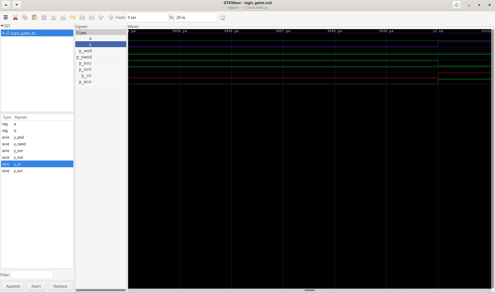

# VLSI-Learning-Journey

My journey learning Digital Design, Verilog, and VLSI. Documenting projects from basics to advanced.

\---

\## Day 1: Logic Gates

✅ Completed: Basic logic gates (AND, OR, NOT, XOR, NAND, NOR)

\### Simulation Results:

)

